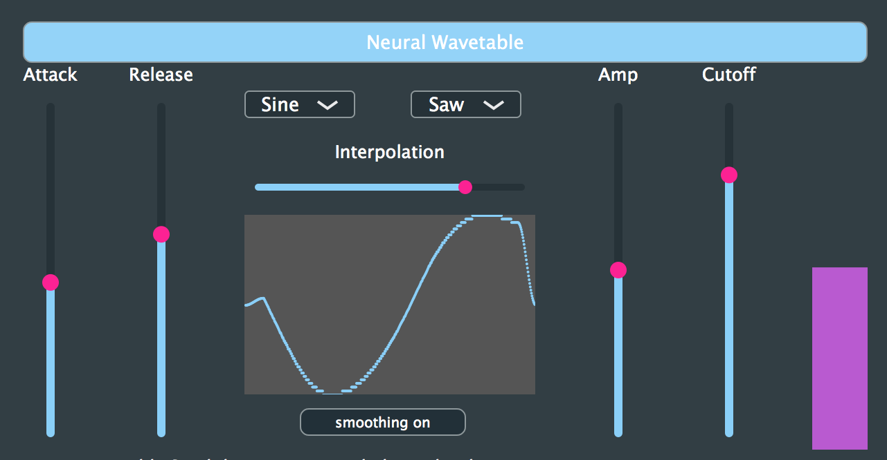

# Neural WaveTable Synth

### Description
A wavetable synthesizer VST that uses WaveNet to interpolate between different wavetables. We include two formats of this synthesizer, a plug-and-play VST you can download and play RIGHT NOW in your DAW! For the more technically inclined, we also include all our source python and c++ code using tensorflow and JUCE for you to experiment and build upon. Happy music-making!

### What is Wavetable synthesis?
If you listen and produce electronic music, you've already heard wavetable synthesis in action. A popular wavetable synthesizer used by many electronic artists is [Serum](https://splice.com/plugins/15493-serum-vst-au-by-xfer-records?utm_source=adwords&utm_medium=paid-search&utm_campaign=acquisition&utm_content=plugins). The new Ableton Live 10 also features a new Wavetable synthesizer called...you guessed it: [Wavetable](https://www.ableton.com/en/packs/wavetable/). The synthesizer works by using a variety of "wavetables" that define one period of the waveform. This reference wavetable is then "read" at different speeds to produce the desired pitch of sound. Check out this [YouTube video](https://www.youtube.com/watch?v=k81hoZODOP0) for an explanation!

### What is WaveNet?
WaveNet is the future of sound! It is a neural network architecture that has revolutionized many aspects of audio, including groundbreaking [speech synthesis](https://deepmind.com/blog/wavenet-generative-model-raw-audio/) and new kinds of [synthesis] (https://nsynthsuper.withgoogle.com/) techniques.

### What is a WaveNet WaveTable?
We use WaveNet to encode some basic wavetables like a Sin, Triangle and Sawtooth - all with length 512 - into WaveNet's latent space. Each of these sounds are now represented by a real-valued "embedding vector" of length 16. This vector encapsulates sonic and timbral characteristics of the original wavetables. We then interpolate between these wavetables, not by adding or subtracting them directly, but by mixing their latent vectors. We then use the newly interpolated vector to decode back into the original wavetable of length 512. To make the decoded wavetables play nice, we normalize all wavetables and also include an option to "smooth" the wave.

### Build Instructions

1. Download the latest version of JUCE from https://shop.juce.com/get-juce
2. Clone our git repository `git clone https://github.com/RichardYang40148/Neural_Wavetable_Synthesizer.git`
3. `cd` into the directory
4. Click on the `WaveNetWaveTable.jucer` file.
5. Click on the XCode icon to open the project in XCode. Build the Project. All dependancies are already included in this repo. 
6. Load the VST in a DAW!

### Open sourced projects 
1. [JUCE framework](https://juce.com/)
2. [Magenta's NSynth model](https://github.com/tensorflow/magenta)
3. [Maximilian](https://github.com/micknoise/Maximilian) 
